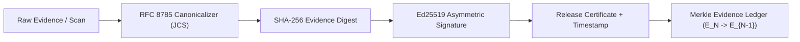

# Castle Gate — Regulatory & Standard Framework Mapping (Mexico & International)

> **Document Version**: 1.0.0-ratified
> **Classification**: Public Engineering & Compliance Standard
> **Associated Standard**: Castle Quality System (CQS v1.1 — FROZEN / 65 Controls)
> **Author**: Grupo Castillo Engineering & Security Governance Committee

---

## 1. Legal Disclaimer & Scope of Technical Alignment

> [!CAUTION]
> **LEGAL NOTICE & REGULATORY SCOPE DISCLAIMER**:
> This document establishes the technical, structural, and cryptographic mapping between the atomic controls of **Castle Quality System (CQS v1.1)** and applicable Mexican national regulations (NOM-151-SCFI-2016, LFPDPPP, CNBV Circular Única de Bancos) as well as international DevSecOps standards (NIST SSDF SP 800-218, OWASP ASVS v4.0.3, MITRE CWE).
>
> **Castle Gate is a deterministic software release governance and evidence assurance engine.**
> Implementing Castle Gate and achieving an authorized release gate level (C1 through C6):
> 1. Demonstrates rigorous, mathematically verifiable technical compliance and supply chain integrity.
> 2. **DOES NOT constitute formal legal certification**, judicial endorsement, or official regulatory clearance by authorities (e.g., Secretaría de Economía, INAI, or CNBV).
> 3. Does not substitute for formal legal counsel, formal compliance audits by accredited certification entities (PSCs), or accredited penetration testing reports.

---

## 2. Executive Mapping Matrix

| Regulation / Standard | Authority / Issuer | Primary Governance Objective | Relevant CQS v1.1 Controls & Engine Features |
| :--- | :--- | :--- | :--- |
| **NOM-151-SCFI-2016** | Secretaría de Economía (México) | Conservación de mensajes de datos, integridad y no-repudio mediante constancias digitales y sellos de tiempo. | Canonical RFC 8785 SHA-256 digests, Ed25519 signatures, Merkle Evidence Ledger (EvidenceLedger), immutable timestamps. |
| **LFPDPPP (Art. 19)** | INAI (México) | Deber de seguridad y confidencialidad en el tratamiento y transmisión de datos personales. | SEC-01.1, SEC-01.2, SEC-02.1..02.4, SEC-05.1, SEC-05.2, GB-01, GB-02. |
| **CNBV CUB (Art. 142)** | Comisión Nacional Bancaria y de Valores | Seguridad de la información, mitigación de vulnerabilidades y resiliencia en canales electrónicos bancarios. | SEC-04.1..04.5, MNT-02.1, MNT-02.2, REL-01.1, REL-02.1, GB-03, GB-04. |
| **NIST SSDF SP 800-218** | NIST (Estados Unidos) | Secure Software Development Framework (Prácticas PO, PS, PW, RV). | SEC-04.1, SEC-05.1, MNT-01.1, MNT-02.1, MNT-02.2, DSSE in-toto Attestations. |
| **OWASP ASVS v4.0.3** | OWASP Foundation | Verificación de controles de seguridad en aplicaciones web (Niveles L1-L3). | SEC-01..SEC-05 (15 controles de seguridad atómicos). |

---

## 3. Detailed Regulatory Mappings

### 3.1. Norma Oficial Mexicana NOM-151-SCFI-2016
**Nombre Oficial**: Requisitos que deben observarse para la conservación de mensajes de datos y digitalización de documentos.

#### Requisitos Técnicos y Alineación en Castle Gate:
1. **Integridad Inalterable del Mensaje de Datos (Numeral 5.1 / 5.2)**:
   - *Requisito*: Garantizar que la información contenida en el documento digital permanezca completa e inalterada desde el momento en que se generó por primera vez.
   - *Implementación*: Castle Gate aplica canonicalización determinista estricta bajo **RFC 8785 (JSON Canonicalization Scheme - JCS)** y calcula resúmenes criptográficos **SHA-256** inalterables tanto en el paquete de evidencias (evidence.json) como en el certificado de release (release-certificate.json).
2. **Fecha y Hora Cierta / Sello de Tiempo (Numeral 5.3)**:
   - *Requisito*: Registro de la fecha y hora de emisión del documento digital.
   - *Implementación*: El motor vincula timestamps UTC (issued_at) en formato ISO-8601 dentro del bloque de datos canónicos firmado asimétricamente.
3. **Firma Electrónica y No-Repudio (Numeral 5.4)**:
   - *Requisito*: Firma electrónica que identifique al emisor y vincule el contenido de forma unívoca.
   - *Implementación*: El motor implementa firmas digitales asimétricas **Ed25519** (pki_signature_extension) y sobres criptográficos **DSSE (Dead Simple Signing Envelope)** bajo especificación de la Linux Foundation / in-toto.
4. **Cadena de Custodia y Trazabilidad Histórica**:
   - *Requisito*: Preservación secuencial de las constancias de evaluación.
   - *Implementación*: El subsistema EvidenceLedger genera un encadenamiento Merkle (parent_hash -> entry_hash), asegurando que ninguna evaluación pueda ser alterada o insertada retroactivamente.

> [!NOTE]
> **Matiz de Cumplimiento**: Castle Gate provee la infraestructura matemática y criptográfica de integridad de datos. En transacciones legales que requieran constancia formal de conservación bajo NOM-151 con validez probatoria plena ante tribunales mexicanos, el hash del Release Certificate puede ser firmado o estampado por un Prestador de Servicios de Certificación (PSC) acreditado por la Secretaría de Economía.

---

### 3.2. Ley Federal de Protección de Datos Personales en Posesión de los Particulares (LFPDPPP)
**Fundamento**: Artículo 19 — Medidas de seguridad administrativas, técnicas y físicas para proteger los datos personales contra daño, pérdida, alteración, destrucción o el uso, acceso o tratamiento no autorizado.

#### Mapeo de Controles CQS v1.1:
- **SEC-01.1 & SEC-01.2 (Cifrado en Tránsito)**:
  - *Alineación*: Verificación obligatoria de protocolos seguros TLS 1.2+ y redirección estricta HTTPS en todos los endpoints que transmiten datos personales.
  - *Gate Breaker*: GB-01 veta de inmediato cualquier release que exponga puertos o rutas en HTTP plano.
- **SEC-02.1 a SEC-02.4 (Defensa en Profundidad en Capa HTTP)**:
  - *Alineación*: Configuración estricta de encabezados de seguridad (Content-Security-Policy, X-Frame-Options, Strict-Transport-Security, X-Content-Type-Options) para mitigar ataques de intermediario (MitM), inyección de scripts y robo de sesiones con acceso a datos personales.
- **SEC-05.1 & SEC-05.2 (Protección contra Fuga de Credenciales y Claves)**:
  - *Alineación*: Inspección de secretos en código estático y en todo el historial Git (GitHistoryProbe), impidiendo que API keys, credenciales de bases de datos o tokens de servicios en la nube con acceso a PII queden expuestos.
  - *Gate Breaker*: GB-02 veta el release ante cualquier secreto detectado.

---

### 3.3. Comisión Nacional Bancaria y de Valores (CNBV) — Circular Única de Bancos (CUB)
**Fundamento**: Artículo 142 y Anexo 52 — Requisitos de Seguridad de la Información, Integridad de Canales Electrónicos y Gestión de Vulnerabilidades en Aplicaciones de Servicios Financieros.

#### Mapeo de Controles CQS v1.1:
- **SEC-04.1 a SEC-04.5 (Pruebas SAST y Mitigación de Vulnerabilidades de Código)**:
  - *Alineación*: Análisis estático de árbol sintáctico (AST) para erradicación de inyecciones SQL (SEC-04.3), Cross-Site Scripting (SEC-04.1), uso de eval() / funciones dinámicas y sumideros DOM inseguros.
- **MNT-02.1 & MNT-02.2 (Control de Software de Terceros y SCA)**:
  - *Alineación*: Auditoría automatizada de dependencias cruzando lockfiles contra la base de datos global de Google OSV.dev y npm audit.
  - *Gate Breakers*: GB-03 y GB-04 bloquean el pase a producción si existen vulnerabilidades críticas o altas no remediadas.
- **REL-01.1 & REL-02.1 (Resiliencia Operativa y Manejo Controlado de Errores)**:
  - *Alineación*: Verificación de manejo controlado de excepciones (cero bloques catch vacíos silenciosos) y telemetría de estabilidad.

---

## 4. Estándares Internacionales de Respaldo

### 4.1. NIST SSDF SP 800-218 (Secure Software Development Framework)
- **PO.1.3**: Proteger la integridad del software y salvaguardar credenciales (SEC-05.1, GB-02).
- **PS.1.1**: Proteger los componentes de software de manipulaciones en el pipeline (Firmas Ed25519, DSSE in-toto).
- **PW.4.1 & PW.4.4**: Adquirir y mantener componentes de terceros seguros (CycloneDX SBOM v1.5, OSV.dev SCA).
- **PW.5.1**: Analizar el código en busca de vulnerabilidades de inyección (AST Analysis, Semgrep/Babel rules).

### 4.2. OWASP ASVS v4.0.3 (Application Security Verification Standard)
- **V2.10.1**: Cero credenciales hardcodeadas (SEC-05.1).
- **V4.2.1**: Protección contra CSRF (SEC-04.2).
- **V5.3.1**: Prevención de DOM XSS e inyección de datos (SEC-04.1).
- **V9.1.1 & V9.1.2**: TLS 1.2+ y HTTPS obligatorio (SEC-01.1, SEC-01.2).
- **V14.2.1 & V14.2.2**: Integridad de manifiestos y auditoría de vulnerabilidades en componentes (MNT-02.1, MNT-02.2).
- **V14.4.1 a V14.4.4**: Cabeceras de seguridad HTTP completas (SEC-02.1 a SEC-02.4).

---

## 5. Control de Cambios y Ratificación

- **Versión del Mapeo**: 1.0.0-ratified
- **Fecha de Ratificación**: 2026-08-18
- **Comité Emisor**: Grupo Castillo Software Assurance & Architecture Board
- **Registro de Integridad CQS**: Compatible con CQS Registry v1.1 (65 Controles Congelados).