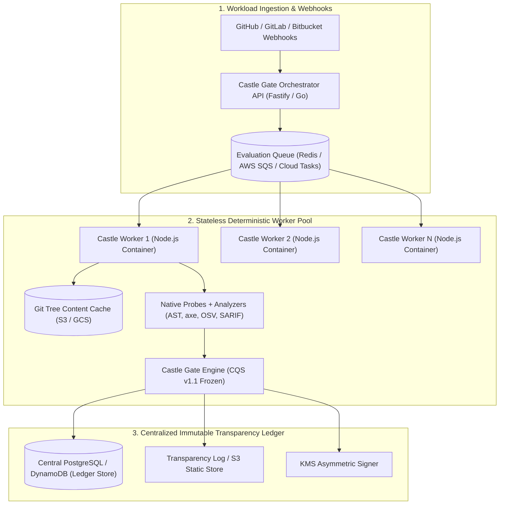

# Castle Gate — Distributed Multi-Repository Scale Blueprint

> **Document Classification**: Architecture Blueprint & Capacity Design (Phase 6 Block 4)  
> **Status**: APPROVED DESIGN BLUEPRINT (NON-CODE / FOR FUTURE MULTI-TENANT SCALE)  
> **Target Workload**: 100+ Concurrent Repositories, 10,000+ Evaluations/Day  

---

## 1. Context & Architectural Anti-Pattern Warning

> [!NOTE]
> Building heavy distributed infrastructure (Kubernetes worker pools, distributed queues, Kafka event brokers) before having real multi-tenant demand is a classic over-engineering trap.
> 
> Castle Gate is designed as a **deterministic, stateless CLI and embedded library core**.
> This blueprint documents the exact architectural pattern for scaling Castle Gate horizontally across hundreds of enterprise repositories when demand materializes, without modifying the frozen CQS core or deterministic decision engine.

---

## 2. Horizontal Architecture Topology



---

## 3. Key Scaling Subsystems

### 3.1. Content-Addressable Evaluation Caching (Git Tree Hash)
- **Problem**: In mono-repos and microservices with frequent PRs, evaluating unchanged code trees is computationally wasteful.
- **Solution**:
  - Castle Gate computes the `git_tree_sha` of the scanned target directory.
  - If `git_tree_sha` AND the active `policy_sha256` match a cached evaluation in the ledger, the engine skips redundant AST / static analysis and re-uses verified sub-evidence payloads, reducing evaluation time from seconds to $<50\text{ ms}$.

### 3.2. Asynchronous Job Scheduling & Resource Isolation
- **Queue Layer**: BullMQ / Redis or AWS SQS with strict per-repository concurrency limits (e.g. max 5 concurrent scans per organization to prevent noisy-neighbor starvation).
- **Worker Sandboxing**: Scans execute inside ephemeral, non-root OCI containers with CPU/memory limits (e.g. 1 vCPU, 512 MB RAM per worker).

### 3.3. Centralized Evidence Ledger with Merkle Tree Partitioning
- **Database Schema**:
  ```sql
  CREATE TABLE evidence_ledger_entries (
    entry_id UUID PRIMARY KEY DEFAULT gen_random_uuid(),
    organization_id VARCHAR(64) NOT NULL,
    repository_url VARCHAR(255) NOT NULL,
    commit_sha CHAR(40) NOT NULL,
    entry_index BIGINT NOT NULL,
    parent_hash CHAR(64) NOT NULL,
    entry_hash CHAR(64) NOT NULL,
    certificate_digest CHAR(64) NOT NULL,
    cqs_score NUMERIC(5,2) NOT NULL,
    gate_state VARCHAR(32) NOT NULL,
    created_at TIMESTAMPTZ NOT NULL DEFAULT NOW(),
    CONSTRAINT uq_repo_entry_index UNIQUE (repository_url, entry_index)
  );
  CREATE INDEX idx_repo_continuity ON evidence_ledger_entries (repository_url, entry_index DESC);
  ```
- **Partitioning**: Partitioned by `repository_url`, ensuring that per-repository Merkle continuity is strictly serial and lock-free across separate repos.

---

## 4. Multi-Tenant Security & Isolation Invariants

1. **Cryptographic Key Isolation**: Each organization / tenant utilizes an independent KMS Key ARN or Approver Trust Ring.
2. **Deterministic Reproducibility**: Given the same commit SHA and policy hash, any worker node yields the exact same canonical RFC 8785 certificate digest regardless of which physical server executed the scan.
