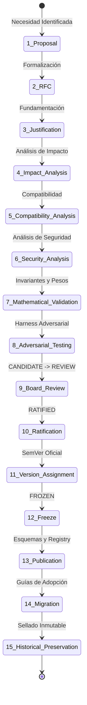

# Castle Quality System (CQS) — Proceso Formal de Versionado y Gobernanza de Evolución

**Versión del Proceso:** 1.0.0  
**Fecha de Ratificación:** Agosto 2026  
**Alcance:** Evolución Metodológica, Control de Versiones e Inmutabilidad Histórica  
**Principio Rector:** *"La metodología es la autoridad; el software únicamente la ejecuta."*

---

## 1. Declaración de Congelamiento de CQS v1.1

La especificación **CQS v1.1** (`specification_version: "1.1.0"`, `status: "RATIFIED_FROZEN"`) se encuentra **definitiva e irrevocablemente congelada**.
Sus invariantes fundamentales:
$$\mathbf{total\_controls = 65} \quad\Big|\quad \mathbf{total\_domains = 7} \quad\Big|\quad \mathbf{nominal\_weight\_total = 100.00}$$
**NO PUEDEN SER MODIFICADOS**. No existe en la actualidad una versión "CQS v1.2", y ninguna alteración a CQS v1.1 está permitida bajo este marco de gobernanza.

Este documento establece el **único proceso formal y normativo** bajo el cual una versión futura (ej. CQS v2.0 o sucesivas) podrá ser propuesta, evaluada, ratificada y publicada en el futuro.

---

## 2. Principios Fundamentales de Inmutabilidad

Cualquier evolución metodológica futura está sujeta a las siguientes restricciones inviolables:

1. **Prohibición de Alteración Retroactiva:** Una versión nueva jamás modificará, recalculará, reescribirá ni invalidará retroactivamente certificados de release emitidos bajo CQS v1.1 u otras versiones previas.
2. **Preservación Histórica:** Las evaluaciones históricas conservan su validez referenciando de forma inmutable el hash SHA-256 de la política y versión de CQS activa al momento de la emisión.
3. **Prohibición de Cambios Silenciosos:** Ningún control, subcriterio, peso nominal o fórmula de scoring puede alterarse sin un RFC público y un proceso completo de ratificación.
4. **Separabilidad Motor / Metodología:** El motor de software (*Castle Gate Engine*) es un evaluador agnóstico; la lógica normativa reside exclusivamente en las especificaciones versionadas.

---

## 3. Ciclo de Vida Formal de una Versión CQS

Una versión CQS debe transitar estrictamente por las siguientes **15 etapas**:

### Detalle de las 15 Etapas:

1. **Proposal (Propuesta Inicial):** Documento preliminar que expone la brecha técnica, normativa o industrial que motiva la necesidad de evolución.
2. **RFC (Request for Comments):** Especificación técnica formal abierta a escrutinio del equipo de arquitectura e ingeniería.
3. **Justificación (Rationale):** Justificación basada en estándares internacionales (ej. OWASP, ISO, WCAG, NIST) que demuestre por qué los controles existentes son insuficientes.
4. **Impact Analysis (Análisis de Impacto):** Evaluación del impacto en pipelines existentes, tiempos de escaneo y tasas de falsos positivos.
5. **Compatibility Analysis (Análisis de Compatibilidad):** Verificación de coexistencia con versiones históricas y evaluadores legados.
6. **Security Analysis (Análisis de Seguridad):** Modelado de amenazas (`THREAT-MODEL.md`) evaluando si los nuevos controles introducen vectores de evasión o DoS.
7. **Mathematical / Invariant Validation (Validación Matemática):** Comprobación matemática estricta de que la suma de pesos nominales sea exactamente 100.00 y que las fórmulas de normalización conserven propiedades de monotonicidad y determinismo.
8. **Adversarial Testing (Pruebas Adversariales):** Creación de casos de prueba de ataque (*Adversarial Harness*) diseñados para intentar bypasses en la nueva especificación.
9. **Architecture Board Review (Revisión de Arquitectura):** Evaluación formal por los roles de liderazgo técnico. Estado: `CANDIDATE` $\rightarrow$ `REVIEW`.
10. **Ratification (Ratificación Formal):** Firma digital del manifiesto de ratificación por la autoridad de gobernanza. Estado: `RATIFIED`.
11. **Version Assignment (Asignación de Versión):** Asignación de identificador SemVer formal (ej. `2.0.0`).
12. **Freeze (Congelamiento Irreversible):** Sellado del artefacto JSON y generación del hash canónico RFC 8785 SHA-256. Estado: `FROZEN`.
13. **Publication (Publicación):** Publicación del esquema JSON schema en el repositorio oficial y distribución del trust anchor correspondiente.
14. **Migration (Migración y Transición):** Publicación de guías de migración y matrices de correspondencia para proyectos en producción.
15. **Historical Preservation (Preservación Histórica):** Registro permanente del artefacto congelado en el ledger de especificaciones normativas.

---

## 4. Clasificación de Cambios y Versionado SemVer

Las modificaciones metodológicas se clasifican estrictamente en 4 categorías:

| Tipo de Cambio | Alcance Metodológico | Incremento SemVer | Requiere Nueva Ratificación |
|---|---|:---:|:---:|
| **Breaking Change (Mayor)** | Adición, eliminación o redefinición de controles; cambios en fórmulas de scoring; alteración de pesos nominales; modificación de Gate Breakers. | **MAJOR** (`X.0.0`) | **SÍ (Proceso Completo 15 Etapas)** |
| **Non-Breaking Change (Menor)** | Incorporación de nuevas fuentes de evidencia o adaptadores hacia controles preexistentes sin alterar su peso ni definición. | **MINOR** (`1.X.0`) | **SÍ (Revisión Técnica y Validaciones)** |
| **Patch / Documentation** | Corrección de erratas tipográficas en descripciones textuales o enlaces a referencias externas sin impacto algorítmico. | **PATCH** (`1.1.X`) | **NO (Aprobación Técnica de Mantenimiento)** |
| **Governance Change** | Actualizaciones a Trust Anchors o rotación de claves del Trust Ring sin alterar la lógica de CQS. | N/A (Versionado de Gobernanza) | **SÍ (Firma de Gobernanza)** |

---

## 5. Transición de Estados Normativos

Toda especificación transita por una máquina de estados unidireccional:

$$mathbf{DRAFT} longrightarrow mathbf{CANDIDATE} longrightarrow mathbf{REVIEW} longrightarrow mathbf{RATIFIED} longrightarrow mathbf{FROZEN}$$

Una vez que una especificación alcanza el estado **`FROZEN`**, es inmutable y no puede retornar a ningún estado previo. Cualquier cambio subsecuente requiere iniciar un nuevo ciclo SemVer.

---

## 6. Autoridad de Gobernanza y Ratificación

Para fines de transparencia y honestidad empírica:

- **Estatus Actual de la Autoridad:** La autoridad de ratificación está constituida actualmente por los **roles técnicos y de arquitectura documentados dentro del repositorio de Grupo Castillo** (`Technical Lead`, `Lead Architect`, `Security Officer`, `CISO`).
- **Naturaleza Documental/Conceptual:** No se aduce la existencia de una junta directiva externa ni un comité regulatorio independiente no formalizado legalmente. La gobernanza opera mediante **firmas criptográficas asimétricas Ed25519** sobre artefactos canónicos RFC 8785 por parte de los operadores autorizados en el Trust Ring.
